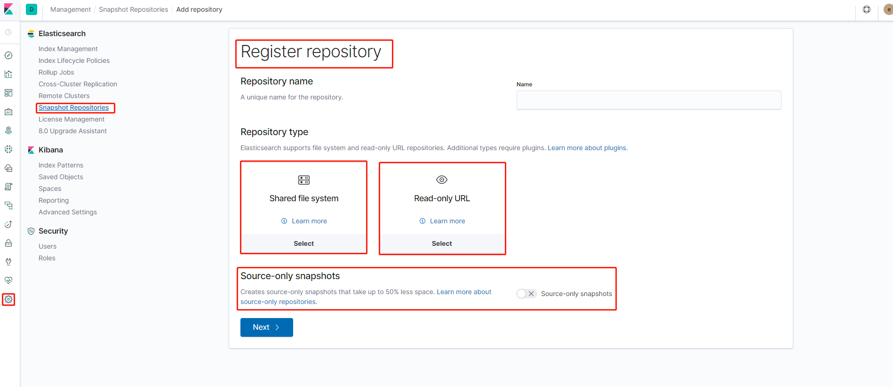
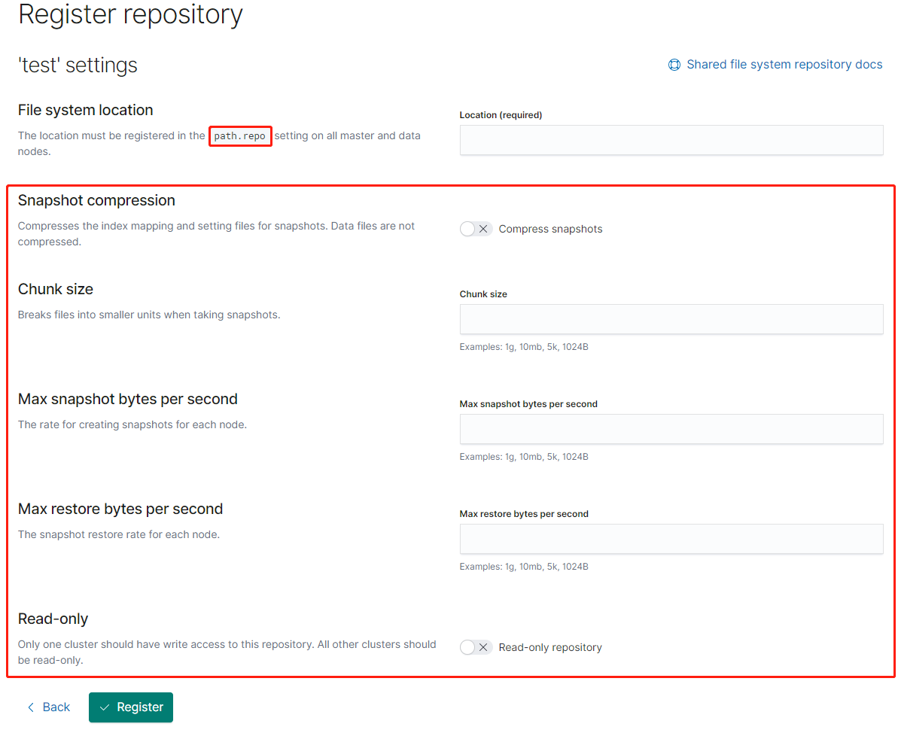

# 一、Context


* shared file system：NFS
* S3
* HDFS

# 二、使用NFS作为快照仓库后端存储

## 1. 在es集群中的某一个节点创建NFS文件系统，ES集群节点进行挂载

```bash
yum install -y nfs-utils rpcbind ;\
systemctl enable nfs ;\
systemctl enable rpcbind ;\
systemctl start nfs ;\
systemctl start rpcbind ;\
mkdir -p /data/es/Elastic-SnapShots ;\
echo "/data/es/Elastic-SnapShots 172.16.3.0/24(rw,sync,no_root_squash,no_subtree_check) " >> /etc/exports ;\
export -r ;\
showmount -e 127.0.0.1
```

## 2. 集群其他节点挂载NFS共享目录

```bash
yum install nfs-utils -y ;\
mkdir -p /data/es/Elastic-SnapShots ;\
echo "172.16.3.5:/data/es/Elastic-SnapShots /data/es/Elastic-SnapShots nfs defaults 0 0" >> /etc/fstab ;\
mount -a ;\
df -mh
```

## 3. 给elasticsearch授予共享目录/data/es/Elastic-SnapShots权限

```bash
chown -R elasticsearch:elasticsearch /data/es/Elastic-SnapShots
```

## 4. ES集群所有节点配置文件设置

```bash
echo 'path.repo: ["/data/es/Elastic-SnapShots"]' >> /etc/elasticsearch/elasticsearch.yml ;\
systemctl restart elasticsearch;\
systemctl status elasticsearch
```

# 三、使用HDFS作为快照仓库后端存储

ES版本：5.6.8 HDFS版本：2.6.0

## 1、所有ES节点安装repository-hdfs插件

在线安装插件
```bash
/usr/share/elasticsearch/bin/elasticsearch-plugin install repository-hdfs
```

离线安装插件，插件下载地址：https://artifacts.elastic.co/downloads/elasticsearch-plugins/repository-hdfs/repository-hdfs-5.6.8.zip

```bash
wget https://artifacts.elastic.co/downloads/elasticsearch-plugins/repository-hdfs/repository-hdfs-5.6.8.zip ;\
/usr/share/elasticsearch/bin/elasticsearch-plugin install file:///root/repository-hdfs-5.6.8.zip
```

## 2、重启ES集群所有节点

```bash
systemctl restart elasticsearch ;\
systemctl status elasticsearch
```

## 3、后续创建HDFS类型仓库时遇到的问题

* ES会以elasticsearch用户(即启动elasticsearch后台进程的用户)在HDFS的/user下创建文件时提示权限不足。所以修改HDFS上/user的权限

    ```bash
    hdfs dfs -chmod -R 777 /user
    ```

* 如果HDFS集群在ES集群外面，ES中的Hadoop客户端向通过Hadoop NameNode节点返回的DataNode节点写数据时会找不到DataNode节点。因为创建仓库时只是指定NameNode节点的外网地址，而返回的DataNode节点IP地址是DataNode向NameNode节点注册的内网IP地址，ES集群根本无法访问到。所以打通两者之间的网络。

# 四、在 kibana 的 Dev Tools 上管理快照仓库

## 1、注册NFS类型的快照仓库

```bash
PUT /_snapshot/快照仓库名
{
  "type": "fs",
  "settings": {
    "compress": true,
    "location": "/data/es/Elastic-SnapShots"
  }
}
## settings的其他参数：

# chunk_size
Big files can be broken down into chunks during snapshotting if needed. The chunk size can be specified in bytes or by using size value notation, i.e. 1g, 10m, 5k. Defaults to null (unlimited chunk size).
#max_restore_bytes_per_sec
Throttles per node restore rate. Defaults to 40mb per second.
#max_snapshot_bytes_per_sec
Throttles per node snapshot rate. Defaults to 40mb per second.
#readonly
Makes repository read-only. Defaults to false.
```

## 2、注册HDFS类型的快照仓库

```bash
PUT _snapshot/快照仓库名
{
  "type": "hdfs",
  "settings": {
    "uri": "hdfs://172.16.3.10:9000",
    "compress": true,
    "path": "elasticsearch/respositories"
  }
}
##settings的其他参数：
​
#uri
The uri address for hdfs. ex: "hdfs://<host>:<port>/". (Required)
#path
The file path within the filesystem where data is stored/loaded. ex: "path/to/file". (Required)
#load_defaults
Whether to load the default Hadoop configuration or not. (Enabled by default)
#conf.<key>
Inlined configuration parameter to be added to Hadoop configuration. (Optional) Only client oriented properties from the hadoop core and hdfs configuration files will be recognized by the plugin.
#compress
Whether to compress the metadata or not. (Disabled by default)
#chunk_size
Override the chunk size. (Disabled by default)
#security.principal
Kerberos principal to use when connecting to a secured HDFS cluster. If you are using a service principal for your elasticsearch node, you may use the _HOST pattern in the principal name and the plugin will replace the pattern with the hostname of the node at runtime (see Creating the Secure Repository).
```

## 3、删除快照仓库

```bash
DELETE /_snapshot/快照仓库名
```

## 4、查看所有的快照仓库
```bash
GET _snapshot/_all
```

# 五、快照管理

## 1、创建包含所有Index的全量快照

```bash
PUT /_snapshot/my_backup/snapshot_1?wait_for_completion=true
```

## 2、创建中包含指定索引的快照

```bash
PUT /_snapshot/快照仓库名/快照名?wait_for_completion=true
{
"indices": "index-A,index-B",
"ignore_unavailable": true,
"include_global_state": false
}
```
## 3、查看仓库中所有的快照

```bash
GET _snapshot/快照仓库名/_all
GET _cat/snapshots/快照仓库名
```

## 4、删除快照

```bash
DELETE _snapshot/快照仓库名/快照名
```

## 5、查看多个快照的状态

```bash
GET /_snapshot/快照仓库名/快照1,快照2/_status
```

## 6、查看某个快照状态

```bash
GET _snapshot/快照仓库名/快照/_status
GET _snapshot/快照仓库名/快照_1,快照名_2/_status
```

## 7、恢复一个快照

```bash
POST _snapshot/快照仓库名/快照名/_restore

# 当恢复快照中的索引名已存在时，可重命名要恢复的索引名
POST _snapshot/快照仓库名/快照名/_restore
{
  "indices": "索引名", 
  "rename_pattern": "索引名",
  "rename_replacement": "索引名-2"
}
```

# 六、使用 `_cat` API格式化查询快照仓库中的的快照

使用Snapshot API查出来的信息是JSON格式的，后续处理比较麻烦。可使用"_cat" API Endpoint格式化查询输出Snapshot仓库中的快照信息。关于"_cat" API的详细使用信息详见[Elasticsearch的"_cat"API](elasticsearch--_cat-API.md)

## 1、查看`_cat`的snapshots API的所有参数

```bash
GET _cat/snapshots?help

或
curl -XGET "http://localhost:9200/_cat/snapshots?help"
```

| 名字 | 简称 | 描述 |
| :-------- | :-------| :-------|
| id | id,snapshot | unique snapshot |
| status | s,status | snapshot name |
| start_epoch | ste,startEpoch | start time in seconds since 1970-01-01 00:00:00|
| start_time | sti,startTime | start time in HH:MM:SS |
| end_epoch | ete,endEpoch | end time in seconds since 1970-01-01 00:00:00 |
| end_time | eti,endTime | end time in HH:MM:SS |
| duration | dur,duration | duration |
| indices | i,indices | number of indices |
| successful_shards | ss,successful_shards | number of successful shards |
| failed_shards | fs,failed_shards | number of failed shards |
| total_shards | ts,total_shards | number of total shards |
| reason | r,reason | reason for failures |

## 2、示例

例如只查看快照仓库中的快照名并排序

```bash
GET _cat/snapshots/pvc-snap-repo?h=id&s=id
或
curl -XGET "http://elasticsearch:9200/_cat/snapshots/pvc-snap-repo?h=id&s=id"

# 返回的结果格式是纯文本的
# apm-7.1.1-metric-2019.07.16-snapshot-2019.07.22
# apm-7.1.1-onboarding-2019.07.16-snapshot-2019.07.22
# apm-7.1.1-span-2019.07.16-snapshot-2019.07.22
# apm-7.1.1-transaction-2019.07.16-snapshot-2019.07.22
# ansi-kpo-tek1269219-h136-2019.07.16-snapshot-2019.07.22
# curiouser-ocp-allinone-audit-2019.08.15-snapshot-2019.08.22
# kibana_sample_data_logs-snapshot-2019.07.22
# springboot2-demo-dev-2019.07.12-snapshot-2019.07.15
# springboot2-demo-dev-2019.07.13-snapshot-2019.07.17
```

# 七、常用脚本

## 1、按月份快照索引

```bash
#!/bin/bash

index_name=test-app
for i in {1..12} ;do
    month=2020-0$i
    index=`curl -s -u elastic:*** -XGET "http://127.0.0.1:9200/_cat/indices/$index_name-$month*?h=i" | tr '\n' ','`
    curl -u elastic:*** \
         -XPUT "http://127.0.0.1:9200/_snapshot/***/collection-$index_name-$month?wait_for_completion=true" \
         -H "Content-Type: application/json" \
         -d '{"indices": "'$index'","ignore_unavailable": true,"include_global_state": false}'
    curl -u elastic:***  -XDELETE "http://127.0.0.1:9200/$index_name-$month*"
done
```

# 八、更新

Elasticsearch 7.2.0新版本有了管理Snapshot Repository的新功能



