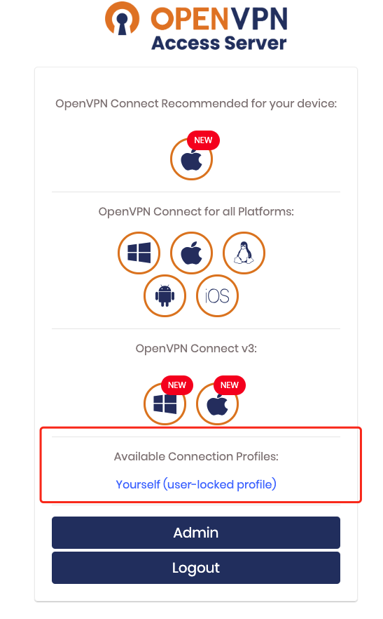

# OpenVPN

# 一、简介

OpenVPN 是一个基于 OpenSSL 库的应用层 VPN 实现。和传统 VPN 相比，它的优点是简单易用。 [1] 

OpenVPN允许参与建立VPN的单点使用共享金钥，电子证书，或者用户名/密码来进行身份验证。它大量使用了OpenSSL加密库中的SSLv3/TLSv1 协议函式库。OpenVPN能在Solaris、Linux、OpenBSD、FreeBSD、NetBSD、Mac OS X与Windows 2000/XP/Vista上运行，并包含了许多安全性的功能。它并不是一个基于Web的VPN软件，也不与IPsec及其他VPN软件包兼容。

- OpenVPN2.0后引入了用户名/口令组合的身份验证方式，它可以省略客户端证书，但是仍有一份服务器证书需要被用作加密。 OpenVPN所有的通信都基于一个单一的IP端口， 默认且推荐使用UDP协议通讯，同时TCP也被支持。OpenVPN连接能通过大多数的代理服务器，并且能够在NAT的环境中很好地工作。服务端具有向客 户端“推送”某些网络配置信息的功能，这些信息包括：IP地址、路由设置等。
- OpenVPN提供了两种虚拟网络接口：通用Tun/Tap驱动，通过它们， 可以建立三层IP隧道，或者虚拟二层以太网，后者可以传送任何类型的二层以太网络数据。传送的数据可通过LZO算法压缩。在选择协议时候，需要注意2个加密隧道之间的网络状况，如有高延迟或者丢包较多的情况下，请选择TCP协议作为底层协议，UDP协议由于存在无连接和重传机制，导致要隧道上层的协议进行重传，效率非常低下。


# 二、安装

## 1、在Synology上安装部署OpenVPN


## 2、使用脚本在Linux服务器搭建

GitHub有个脚本项目专门安装OpenVPN server，地址：https://github.com/Nyr/openvpn-install 

```bash
wget https://git.io/vpn -O openvpn-install.sh && bash openvpn-install.sh
```


## Ubuntu 

### ①APT

```bash
apt update && apt -y install ca-certificates wget net-tools gnupg
wget -qO - https://as-repository.openvpn.net/as-repo-public.gpg | apt-key add -
echo "deb http://as-repository.openvpn.net/as/debian bionic main">/etc/apt/sources.list.d/openvpn-as-repo.list
apt update && apt -y install openvpn-as
```

### ②Deb包（推荐）

使用APT安装时、服务器可能需要能翻墙。

deb包手动下载地址：

https://openvpn.net/downloads/openvpn-as-latest-ubuntu18.amd_64.deb

https://openvpn.net/downloads/openvpn-as-bundled-clients-latest.deb

```bash
apt update
apt install -y liblzo2-2 bridge-utils net-tools python-pyrad python-serial libsasl2-2 iproute2 sqlite3 libsqlite3-0 iptables liblz4-1 python-pkg-resources python-mysqldb libmariadbclient18 libssl1.1
dpkg -i openvpn-as-bundled-clients-11.deb openvpn-as_2.8.5-f4ad562b-Ubuntu18_amd64.deb
```

## 3、CentOS/Redhat

### ①YUM

```bash
yum -y install https://as-repository.openvpn.net/as-repo-centos7.rpm
# 或者
yum -y install https://as-repository.openvpn.net/as-repo-centos8.rpm
yum -y install openvpn-as
```


## 4、使用OVA模版在ESXI上部署

- 官方文档：https://openvpn.net/vpn-server-resources/deploying-the-access-server-appliance-on-vmware-esxi/

- 最新ESXI OVA部署模板下载地址：https://openvpn.net/downloads/openvpn-as-latest-vmware.ova

- 支持在ESXI 5.0+ 上部署。直接使用vSphere Client客户端导入OVA文件创建虚拟机，步骤省略。

- 使用OVA部署OpenVPN Server的License只支持两个用户同时在线
- 默认使用sqlite存储数据，支持将数据转换存储到MySQL中
- 支持对接LDAP认证

### 虚拟机基本信息

- 1vCPU 1GB内存 512MB交换内存
- OS版本：Ubuntu 18.04.3 Server LTS x64
- 默认SSH用户密码：root / openvpnas
- 软件根路径：/usr/local/openvpn_as
- 日志目录：/usr/local/openvpn_as/init.log
- 重新配置命令：/usr/local/openvpn_as/bin/ovpn-init
- 已安装VM Tools，未安装curl

## 5、安装后注意

### ①修改时区为CST。默认时区为US(Pacific - Los Angeles)

```bash
timedatectl set-timezone "Asia/Shanghai"
# 设置时区
timedatectl status 
# 查看当前的时区状态
date -R
# 查看时区
```

### ②设置openvpn用户密码（默认没有设置）

```bash
passwd openvpn
```

### ③(可选)设置静态IP地址（默认DHCP）

```bash
nano /etc/netplan/01-netcfg.yaml
# 配置模板
network:
  version: 2
  renderer: networkd
  ethernets:
    eth0:
     dhcp4: no
     # ip设置为192.168.79.2
     addresses: [192.168.70.2/24] 
     gateway4: 192.168.70.254
     nameservers:
       addresses: [192.168.70.254]
       
netplan apply
```

### ④Web UI访问地址

- 普通用户访问地址：https://openvpnas-ip:943 
- 管理员访问地址 ：https://openvpnas-ip:943/admin （默认用户openvpn，密码初始没有，需设置）

# 三、OpenVPN服务端配置

```bash
push "route 192.168.1.0 255.255.255.0"
push "route 10.8.0.0 255.255.255.0"
push "dhcp-option DNS 192.168.1.7"
dev tun
management 127.0.0.1 1195
server 10.8.0.0 255.255.255.0
client-config-dir ccd
dh keys/ca..pm
ca keys/ca.crt
cert keys/server.crt
key keys/server.key
max-clients 5
comp-lzo
persist-tun
persist-key
verb 3
#log-append /var/log/openvpn.log
keepalive 10 60
reneg-sec 0
plugin /var/packages/VPNCenter/target/lib/radiusplugin.so /var/packages/VPNCenter/target/etc/openvpn/radiusplugin.cnf
client-cert-not-required
username-as-common-name
duplicate-cn
status /tmp/ovpn_status_2_result 30
status-version 2
proto tcp6-server
port 19382
cipher AES-256-CBC
auth RSA-SHA256
```


# 四、客户端连接配置

不管是在Synology还是ESXI上安装的OpenVPN Server，都提供下载配置文件的连接。下载好配置文件后，可直接使用各个平台下的客户端直接导入打开




官方提供了各种平台下的客户端程序并提供了对应的文档说明

各客户端官方文档：https://openvpn.net/vpn-server-resources/connecting/


## MacOS客户端tunnelblick

MacOS上有好多客户端可以连接OpenVPN，功能大同小异。同时官方也有自己的macOS客户端`OpenVPN Connect Client`。但是推荐tunnelblick（官方也推荐），可同时连接多个OpenVPN Server

官方客户端文档：https://openvpn.net/vpn-server-resources/connecting-to-access-server-with-macos/

OpenVPN Connect Client for MacOS下载地址：https://openvpn.net/downloads/openvpn-connect-v3-macos.dmg

Tunnelblick下载地址：https://github.com/Tunnelblick/Tunnelblick/releases

## Windows客户端OpenVPN GUI

OpenVPN官网提供Windows平台客户端OpenVPN GUI。

只需将配置文件放在`C:\Users\当前用户\OpenVPN\config`文件下即可。(`~\OpenVPN\config`需手动创建)

官方客户端一次只能连一个服务端，如果有连接多个服务端的话，需要来回切换。

官方文档：https://openvpn.net/vpn-server-resources/connecting-to-access-server-with-windows/

下载地址：https://openvpn.net/community-downloads/

## Android

安卓手机平台官方虽说也提供客户端，但是只能在Google Play Store商店中下载，同时还一次只能连一个服务端。所以我们只好使用第三方客户端[ics-openvpn](https://github.com/schwabe/ics-openvpn)

GitHub地址：https://github.com/schwabe/ics-openvpn

APK下载地址：http://plai.de/android/ 

## IOS

对于Apple IOS手机客户端，官方APP名为`OpenVPN Connect`。而且一次只能连一个服务端。同时国内App Store还下不到。你说气不气。其他第三方客户端大多收费。幸好手机不是Iphone。这个就不管了！

## Linux

OpenVPN协议不是Linux内置的协议。因此，需要一个客户端程序，该程序可以处理捕获OpenVPN隧道发送的流量，并将其加密并将其传递给OpenVPN服务器。当然，反之亦然，解密返回的流量。因此，需要一个客户端程序。在大多数Linux发行版中该软件包简称为 **openvpn**(OpenVPN 服务端的程序包为 **openvpnas**或 **openvpn-as**)。

```bash
# CentOS
yum install -y openvpn
# Ubuntu
apt-get install -y openvpn
```

openvpn支持同时连接多个OpenVPN服务器，并且还带有一个服务组件，该组件可以自动和静默地启动在**/etc/openvpn中**找到的任何自动登录配置文件。可以将该服务组件设置为使用Linux发行版中提供的工具在启动时自动启动。在Ubuntu和Debian上，当您安装 **openvpn**软件包时，它会自动配置为在引导时启动。将**client.ovpn**配置文件放在 **/etc/openvpn/中**并重命名该文件。它必须以**.conf**结尾 作为文件扩展名。确保重新启动后可以运行服务守护程序，然后再重新启动系统即可。自动登录类型配置文件将自动被提取，并且连接将自动启动。您可以通过检查例如**ifconfig**命令的输出来验证这一点 ，然后您将在列表中看到 **tun0**网络适配器。

手动指定配置文件：

```bash
openvpn --config client.ovpn --auth-user-pass --daemon
```

命令行客户端缺少的一项主要功能是能够自动实现VPN服务器推送的DNS服务器，但是需要您安装DNS管理程序，例如resolvconf或openresolv，并且它可能与操作系统中的现有网络管理软件冲突，也可能不冲突。但在Ubuntu和Debian上，openvpn软件包随附了 **/etc/openvpn/update-resolv-conf** 脚本，该脚本处理这些操作系统的DNS实现。只需要在客户端配置文件中设置连接建立断开时执行它。

```bash
# 编辑客户端配置文件 vi client.ovpn
script-security 2
# 设置执行额外的脚本
up /etc/openvpn/update-resolv-conf
# 设置在连接建立时要执行的脚本路径
down /etc/openvpn/update-resolv-conf
# 设置在连接断开时要执行的脚本路径
```

# 五、访问限制策略

默认配置下，所有客户端都可以访问服务端配置中的指定网络段。但是在实际使用场景中，需要限制指定客户端访问指定网络，限制其访问某些服务。例如：开发人员只允许访问开发网络段中的服务器，测试人员只能访问测试网络段的服务器资源等等。

## 1、openVPN服务端配置文件添加

```bash
client-config-dir ccd
```

## 2、新建ccd目录及客户端文件

新建ccd目录，在ccd目录下新建以用户名命名的文件。并且通过ifconfig-push分配地址，注意这里需要分配两个地址，一个是客户端本地地址，另一个是服务器的ip端点。

```bash
mkdir ccd
echo ”ifconfig-push 10.8.0.9 10.8.0.10" >> ccd/vpn_test_user
```

每个端点的IP地址对的最后8位字节必须取自下面的集合

```
[1, 2]  [5, 6]  [9, 10]  [13, 14]  [17, 18] [21, 22]  [25, 26]  [29, 30]  [33, 34]  [37, 38] [41, 42]  [45, 46]  [49, 50]  [53, 54]  [57, 58] [61, 62]  [65, 66]  [69, 70]  [73, 74]  [77, 78] [81, 82]  [85, 86]  [89, 90]  [93, 94]  [97, 98] [101,102]  [105,106]  [109,110]  [113,114]  [117,118] [121,122]  [125,126]  [129,130]  [133,134]  [137,138] [141,142]  [145,146]  [149,150]  [153,154]  [157,158] [161,162]  [165,166]  [169,170]  [173,174]  [177,178] [181,182]  [185,186]  [189,190]  [193,194]  [197,198] [201,202]  [205,206]  [209,210]  [213,214]  [217,218] [221,222]  [225,226]  [229,230]  [233,234]  [237,238] [241,242]  [245,246]  [249,250]  [253,254]
```

客户端连接验证地址分配

```
utun2: flags=8051<UP,POINTOPOINT,RUNNING,MULTICAST> mtu 1500
	inet 10.8.0.9 --> 10.8.0.10/32 utun2
```

## 3、配置iptables的限制

①禁止`vpn_test_user`用户访问`192.168.1.5`

```bash
iptables -A FORWARD -s 10.8.0.10 -d 192.168.1.5 -j DROP
```

## 4、iptables规则的维护

### ①查看添加的规则

以number的方式查看规则，一条一条的出来，然后我们根据号码来删除哪一条规则

```bash
iptables -L FORWARD --line-numbers
```

### ②删除指定的规则

```bash
iptables -D FORWARD 1
```

### ③删除所有规则

```
iptables -F
```


# 参考

1. http://www.fblinux.com/?p=1181
2. http://www.linuxfly.org/post/86/
3. https://www.aikaiyuan.com/11839.html
4. https://www.hotbak.net/key/32f744eec5330289d21a981ecf2d595a_29.html
5. https://lesca.me/archives/iptables-examples.html


